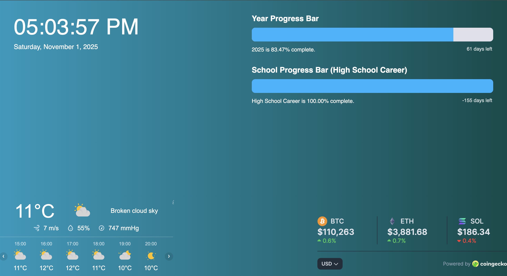

<h1>Dakboard-style Personal Dashboard</h1>

This is a personal dashboard project I wanted to create to be able to open up on a side monitor while working at my desk, inspired by the DAKboard website.

 <h1>About this project</h1>
Not being familiar to frontend development, I used AI-powered tools to generate the initial code for this project. This helped me learn the basics of HTML, JavaScript, CSS, and API integration for web development. I then customized the generated code to fit my specific needs.

## Features
- Displays current time and date (preset to my local timezone)
- Shows weather information (preset to my location)
- Gives recent cryptocurrency prices for Bitcoin, Ethereum, and Solana via the CoinGecko API
- Includes progress bar showing the current year progression
- Includes three custom progress bars which marked the progression, and end of highschool milestones

## Technologies Used
- HTML
- CSS
- JavaScript
- CoinGecko API